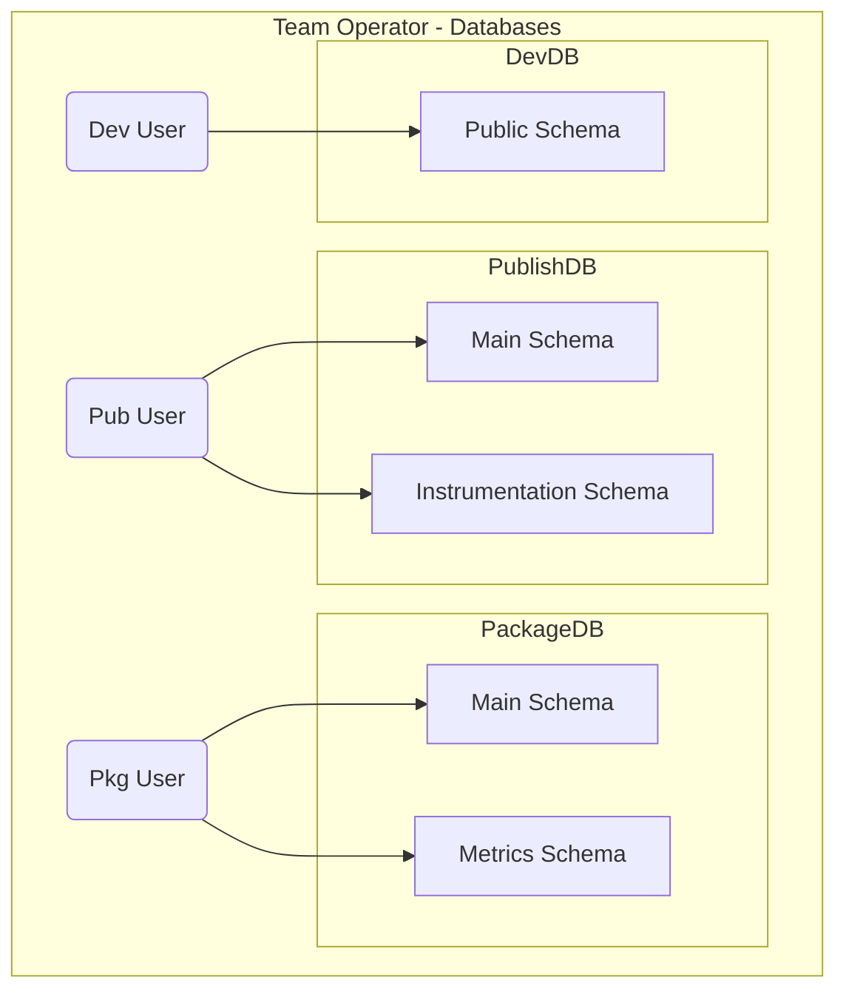
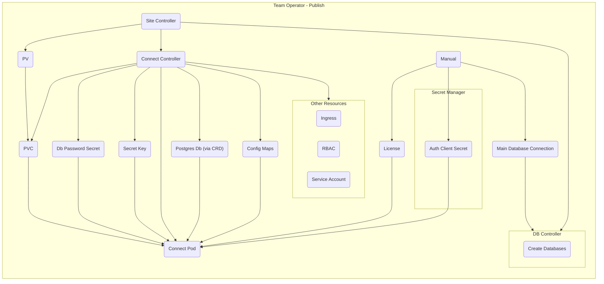

# Team Operator

A Kubernetes operator that manages the deployment and lifecycle of Posit Team products (Workbench, Connect, Package Manager, and Chronicle) within Kubernetes clusters.

## Overview

The Team Operator is a Kubernetes controller built using [Kubebuilder](https://book.kubebuilder.io/) that automates the deployment, configuration, and management of Posit Team products. It handles:

- Multi-product Posit Team deployments through a single `Site` Custom Resource
- Database provisioning and management for each product
- Secure credential management via Kubernetes secrets or AWS Secrets Manager
- License configuration and validation
- Ingress routing and load balancing
- Shared storage configuration across products
- Keycloak integration for authentication
- Off-host execution support for Workbench and Connect

## Components

### Flightdeck

Flightdeck is the landing page and dashboard for Posit Team deployments. It provides:

- Product navigation cards for Workbench, Connect, and Package Manager
- Responsive layout that automatically adjusts based on enabled products
- Optional Academy integration
- Configuration page access (when enabled)

#### Configuration

Flightdeck can be configured through the Site spec under `spec.flightdeck`:

```yaml
spec:
  flightdeck:
    image: ghcr.io/rstudio/flightdeck:latest
    replicas: 1
    featureEnabler:
      showConfig: false    # Enable /config page
      showAcademy: false   # Show Academy product card
```

**Layout behavior:**
- When Academy is hidden (default), the three core products (Workbench, Connect, Package Manager) are displayed with Workbench and Connect in the first row, and Package Manager centered in the second row
- When Academy is shown, all four products display in a 2x2 grid

**Static assets:**
- Images and CSS are served from the `/static` path
- Assets are included in the Flightdeck container image

## Quick Start

### Prerequisites

- Kubernetes cluster (1.29+)
- kubectl configured to access your cluster
- Go 1.21+ (for local development)
- Docker (for building images)
- Just command runner (`brew install just` or see [installation guide](https://github.com/casey/just))

### Installation

#### Via Helm (Recommended)

```bash
# Install from local chart
helm install team-operator ./dist/chart \
  --namespace posit-team-system --create-namespace

# With custom image
helm install team-operator ./dist/chart \
  --namespace posit-team-system --create-namespace \
  --set controllerManager.container.image.repository=posit/team-operator \
  --set controllerManager.container.image.tag=latest
```

#### Via Kustomize (Development)

```bash
make deploy IMG=posit/team-operator:latest
```

### Local Development

```bash
# Install dependencies
just deps

# Run tests
just test

# Build the operator binary
just build

# Run operator locally against your cluster
just run

# After API changes, regenerate manifests
just mgenerate

# Helm chart targets
just helm-lint       # Lint the Helm chart
just helm-template   # Render templates locally
just helm-install    # Install via Helm
just helm-uninstall  # Uninstall via Helm
```

## Configuration

The Site CR defines a complete Posit Team deployment. Secrets and licenses are managed automatically through cloud provider integration (AWS Secrets Manager or Azure Key Vault) - configured during PTD bootstrap.

Example Site configuration:
```yaml
apiVersion: core.posit.team/v1beta1
kind: Site
metadata:
  name: my-site
  namespace: posit-team
spec:
  domain: example.com

  # Flightdeck configuration (optional)
  flightdeck:
    featureEnabler:
      showAcademy: false  # Hide Academy from landing page

  # Products to deploy
  workbench:
    image: ghcr.io/rstudio/rstudio-workbench-daily:latest

  connect:
    image: ghcr.io/rstudio/rstudio-connect-daily:latest
    # ... additional config
```

## Architecture Diagrams

### Database



### Publish / Connect


## Troubleshooting

Check operator logs:
```bash
kubectl logs -n posit-team-system deployment/team-operator-controller-manager
```

Check site status:
```bash
kubectl describe site -n posit-team <site-name>
```

## License

MIT License - see [LICENSE](LICENSE) file for details.

Copyright (c) 2023-2026 Posit Software, PBC
