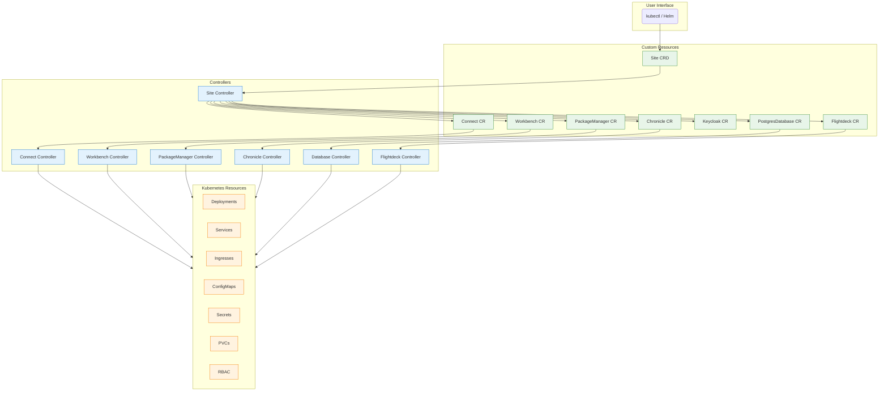
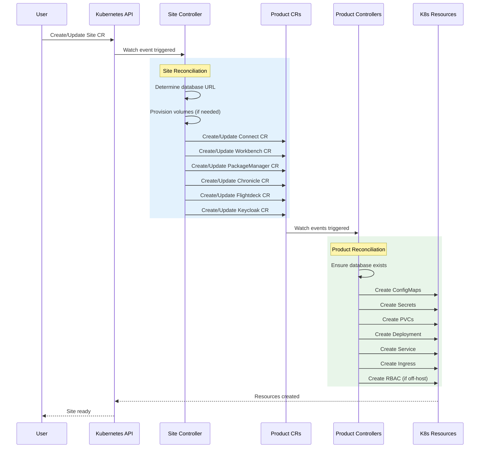
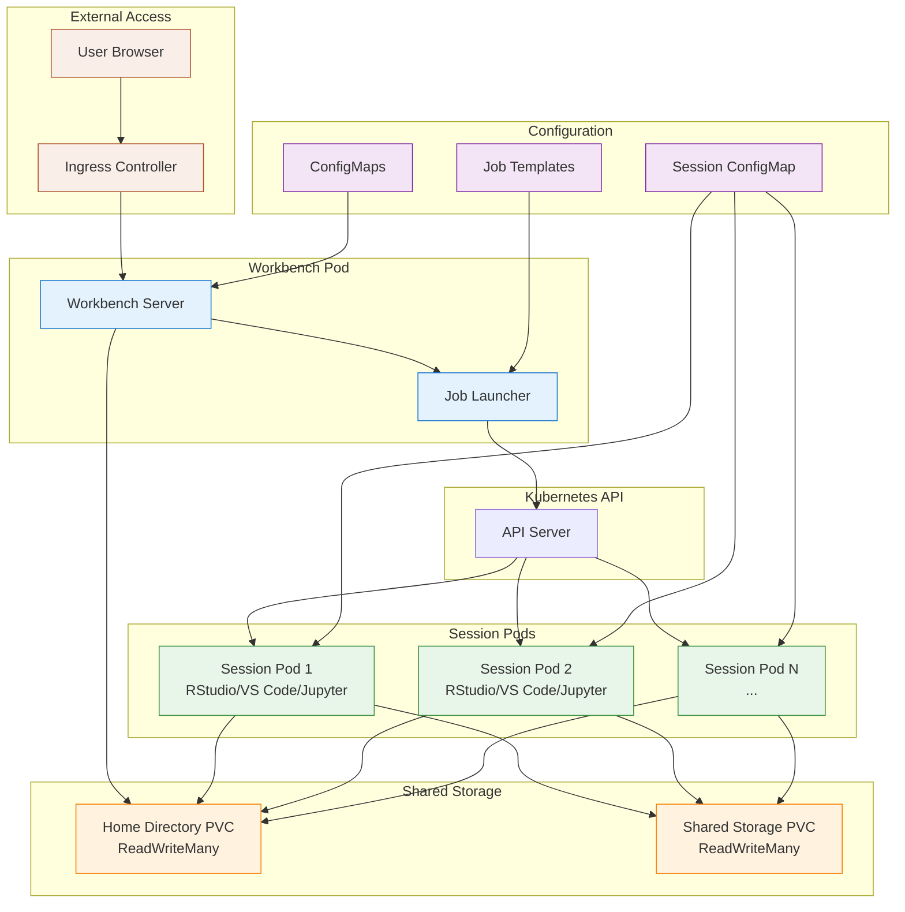
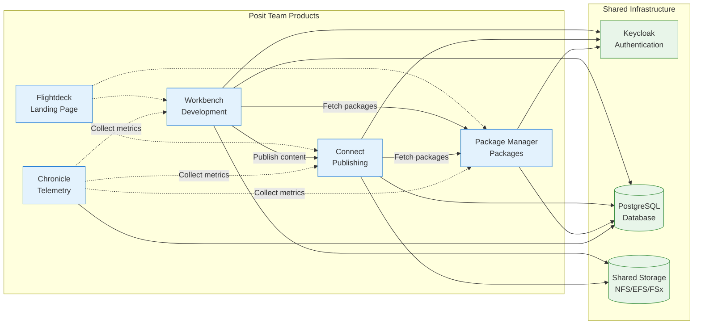

# Team Operator

The Team Operator is a Kubernetes operator that manages the deployment and configuration of Posit Team products within a Kubernetes cluster.

## Overview

The Team Operator automates the deployment and lifecycle management of:
- **Workbench** - Interactive development environment
- **Connect** - Publishing and sharing platform
- **Package Manager** - Package repository management
- **Chronicle** - Telemetry and monitoring
- **Keycloak** - Authentication and identity management

## Architecture

The operator uses a hierarchical configuration model:

```
Site CRD (single source of truth)
    ├── Connect configuration
    ├── Workbench configuration
    ├── Package Manager configuration
    ├── Chronicle configuration
    └── Keycloak configuration
```

The Site controller watches for Site resources and reconciles product-specific Custom Resources for each enabled product.

### Overall System Architecture



### Reconciliation Flow



### Workbench Architecture



### Component Relationships



## Key Concepts

### Site CRD

The `Site` Custom Resource is the primary configuration point. It contains:
- Global settings (domain, secrets, storage)
- Product-specific configuration sections
- Feature flags and experimental options

### Configuration Propagation

Configuration flows from Site CRD to individual product CRDs:

1. User edits Site spec
2. Site controller detects change
3. Site controller updates product CRs
4. Product controllers reconcile deployments

See [Adding Config Options](../guides/adding-config-options.md) for details on extending configuration.

## Quick Start

### View Sites

```bash
kubectl get sites -n posit-team
```

### Edit a Site

```bash
kubectl edit site main -n posit-team
```

### Check Operator Logs

```bash
# Operator runs in posit-team-system namespace
kubectl logs -n posit-team-system deployment/team-operator-controller-manager
```

## Namespaces

Team Operator uses two namespaces:

| Namespace | Purpose |
|-----------|---------|
| `posit-team-system` | Where the operator controller runs |
| `posit-team` (or configured `watchNamespace`) | Where Site CRs and deployed products live |

## Related Documentation

### Deployment and Operations

- [Site Management Guide](guides/product-team-site-management.md) - Creating, updating, and managing Site resources
- [Upgrading Guide](guides/upgrading.md) - Upgrade procedures and version migrations
- [Troubleshooting Guide](guides/troubleshooting.md) - Common issues and debugging techniques

### Product Configuration

- [Workbench Configuration](guides/workbench-configuration.md) - Interactive development environment setup
- [Connect Configuration](guides/connect-configuration.md) - Publishing platform configuration
- [Package Manager Configuration](guides/packagemanager-configuration.md) - Package repository management

### Authentication and Security

- [Authentication Setup](guides/authentication-setup.md) - SSO, OAuth, and Keycloak integration

### Reference

- [Architecture](architecture.md) - Detailed architecture diagrams with component explanations
- [API Reference](api-reference.md) - Complete CRD field reference for all resources

### For Contributors

- [Adding Config Options](guides/adding-config-options.md) - How to extend Site/product configurations
