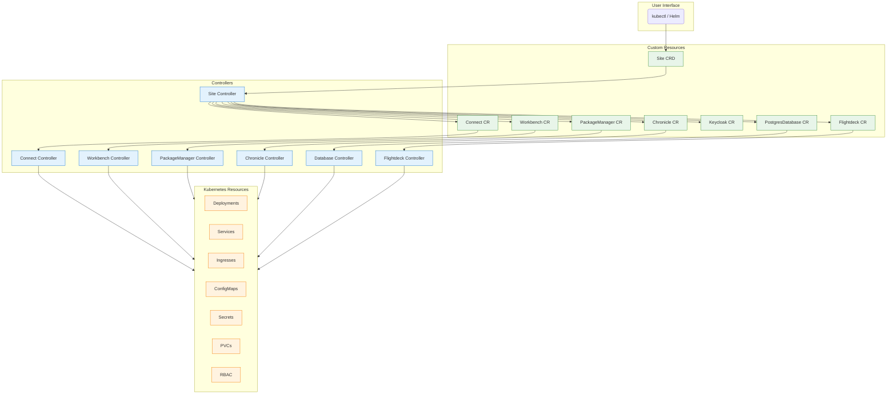

# Team Operator

Team Operator is a Kubernetes operator that manages the full lifecycle of Posit Team products — deployment, configuration, upgrades, and reconciliation. It is intended for platform engineers and administrators running Posit Workbench, Connect, Package Manager, Chronicle, and Keycloak on Kubernetes.

## How It Works

The operator's central concept is the `Site` Custom Resource (CR). Rather than configuring each product separately, you define a single Site object that describes your entire Posit Team deployment — which products to enable, what domain to use, how storage is provisioned, and product-specific settings. The Site controller reads this resource and creates individual product CRs for each enabled product. Each product then has its own controller that translates that CR into the Deployments, Services, Ingresses, ConfigMaps, Secrets, and PVCs that Kubernetes actually runs.

This hierarchy means you have one place to look when something is misconfigured, and one place to make changes that propagate consistently across all products.

### Overall System Architecture


```mermaid
flowchart TB
    subgraph user [User Interface]
        kubectl(kubectl / Helm)
    end

    subgraph crd [Custom Resources]
        site[Site CRD]
        connect_cr[Connect CR]
        workbench_cr[Workbench CR]
        pm_cr[PackageManager CR]
        chronicle_cr[Chronicle CR]
        keycloak_cr[Keycloak CR]
        flightdeck_cr[Flightdeck CR]
        pgdb_cr[PostgresDatabase CR]
    end

    subgraph controllers [Controllers]
        site_ctrl[Site Controller]
        connect_ctrl[Connect Controller]
        workbench_ctrl[Workbench Controller]
        pm_ctrl[PackageManager Controller]
        chronicle_ctrl[Chronicle Controller]
        db_ctrl[Database Controller]
        flightdeck_ctrl[Flightdeck Controller]
    end

    subgraph k8s [Kubernetes Resources]
        deployments[Deployments]
        services[Services]
        ingresses[Ingresses]
        configmaps[ConfigMaps]
        secrets[Secrets]
        pvcs[PVCs]
        rbac[RBAC]
    end

    %% User creates Site
    kubectl --> site

    %% Site controller creates product CRs
    site --> site_ctrl
    site_ctrl --> connect_cr
    site_ctrl --> workbench_cr
    site_ctrl --> pm_cr
    site_ctrl --> chronicle_cr
    site_ctrl --> keycloak_cr
    site_ctrl --> flightdeck_cr
    site_ctrl --> pgdb_cr

    %% Product controllers watch CRs
    connect_cr --> connect_ctrl
    workbench_cr --> workbench_ctrl
    pm_cr --> pm_ctrl
    chronicle_cr --> chronicle_ctrl
    pgdb_cr --> db_ctrl
    flightdeck_cr --> flightdeck_ctrl

    %% Controllers create K8s resources
    connect_ctrl --> k8s
    workbench_ctrl --> k8s
    pm_ctrl --> k8s
    chronicle_ctrl --> k8s
    db_ctrl --> k8s
    flightdeck_ctrl --> k8s

    classDef crdStyle fill:#E8F5E9,stroke:#388E3C
    classDef ctrlStyle fill:#E3F2FD,stroke:#1976D2
    classDef k8sStyle fill:#FFF3E0,stroke:#F57C00

    class site,connect_cr,workbench_cr,pm_cr,chronicle_cr,keycloak_cr,flightdeck_cr,pgdb_cr crdStyle
    class site_ctrl,connect_ctrl,workbench_ctrl,pm_ctrl,chronicle_ctrl,db_ctrl,flightdeck_ctrl ctrlStyle
    class deployments,services,ingresses,configmaps,secrets,pvcs,rbac k8sStyle
```

## Namespaces

Team Operator uses two namespaces:

| Namespace | Purpose |
|-----------|---------|
| `posit-team-system` | Operator controller runs here |
| `posit-team` (or configured `watchNamespace`) | Site CRs and deployed products run here |

## Common Operations

```bash
# List Site resources
kubectl get sites -n posit-team

# Edit a Site
kubectl edit site main -n posit-team

# Check operator logs
kubectl logs -n posit-team-system deployment/team-operator-controller-manager
```

## Where to Go Next

Choose based on what you're trying to do:

**Installing or operating Team Operator**
- [Installation Guide](guides/installation.md) — Installing Team Operator on Kubernetes using Helm
- [Site Management Guide](guides/product-team-site-management.md) — Creating, updating, and managing Site resources
- [Upgrading Guide](guides/upgrading.md) — Upgrade procedures and version migrations
- [Troubleshooting Guide](guides/troubleshooting.md) — Common issues and debugging techniques

**Configuring a specific product**
- [Workbench Configuration](guides/workbench-configuration.md) — Interactive development environment setup
- [Connect Configuration](guides/connect-configuration.md) — Publishing platform configuration
- [Package Manager Configuration](guides/packagemanager-configuration.md) — Package repository management

**Setting up authentication**
- [Authentication Setup](guides/authentication-setup.md) — SSO, OAuth, and Keycloak integration

**Understanding how it works**
- [Architecture](architecture.md) — Detailed architecture diagrams with per-component explanations
- [API Reference](api-reference.md) — Complete CRD field reference for all resources

**Contributing**
- [Adding Config Options](guides/adding-config-options.md) — How to extend Site and product configurations
