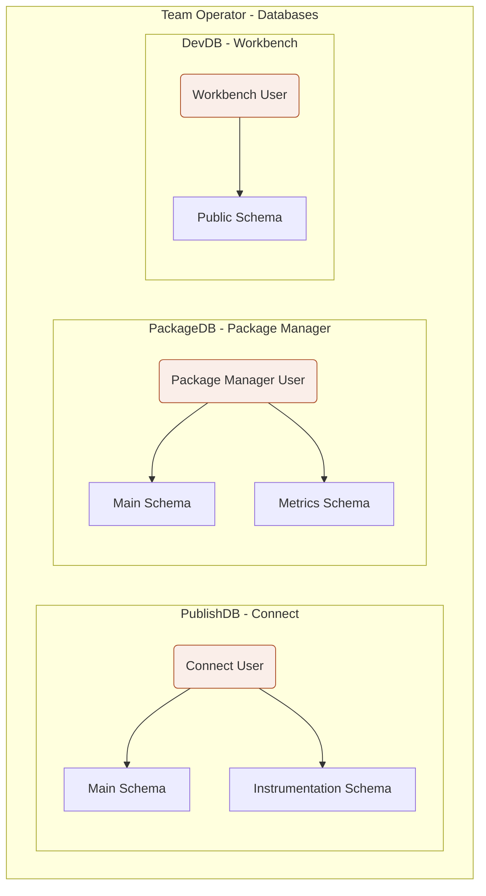
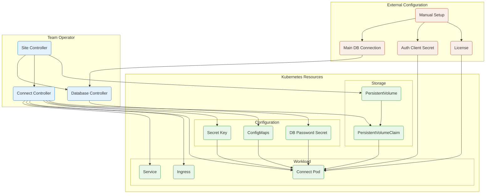
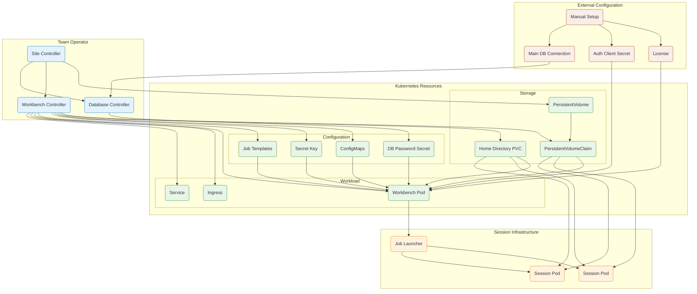
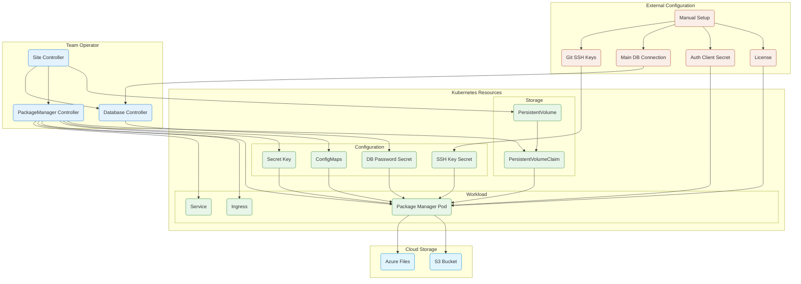
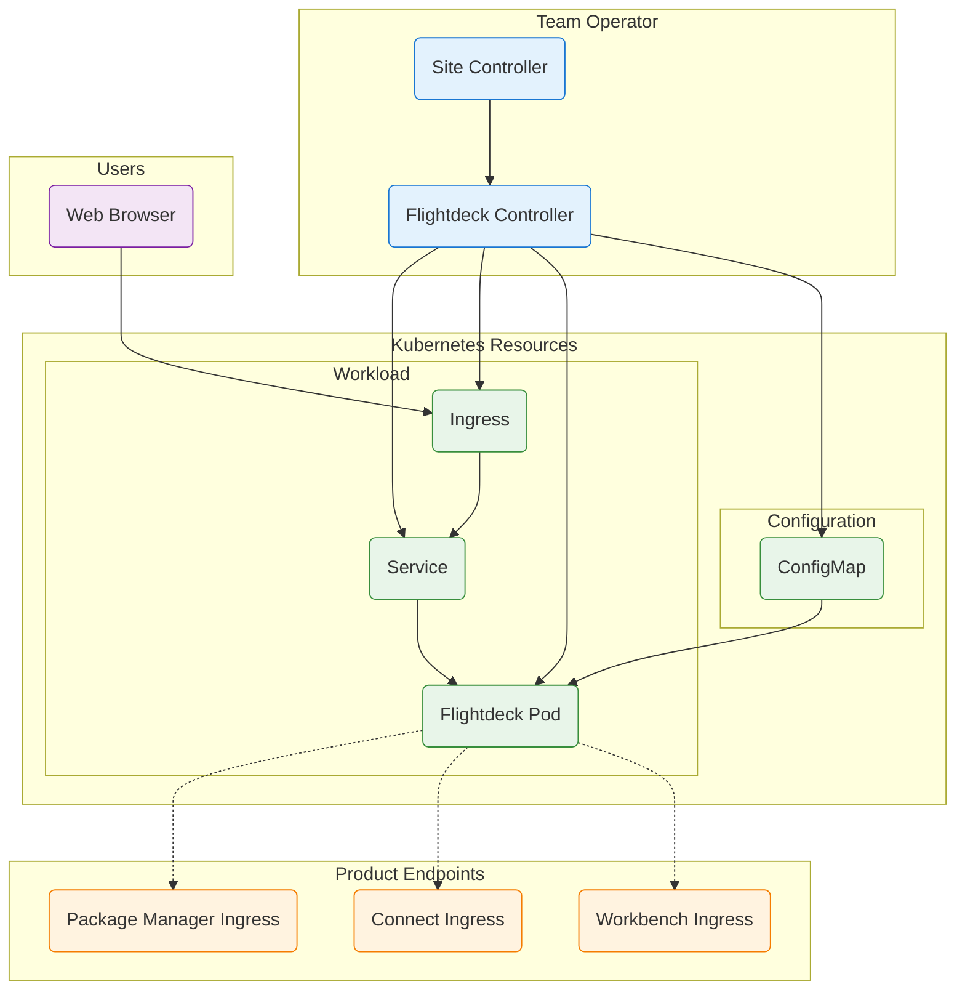
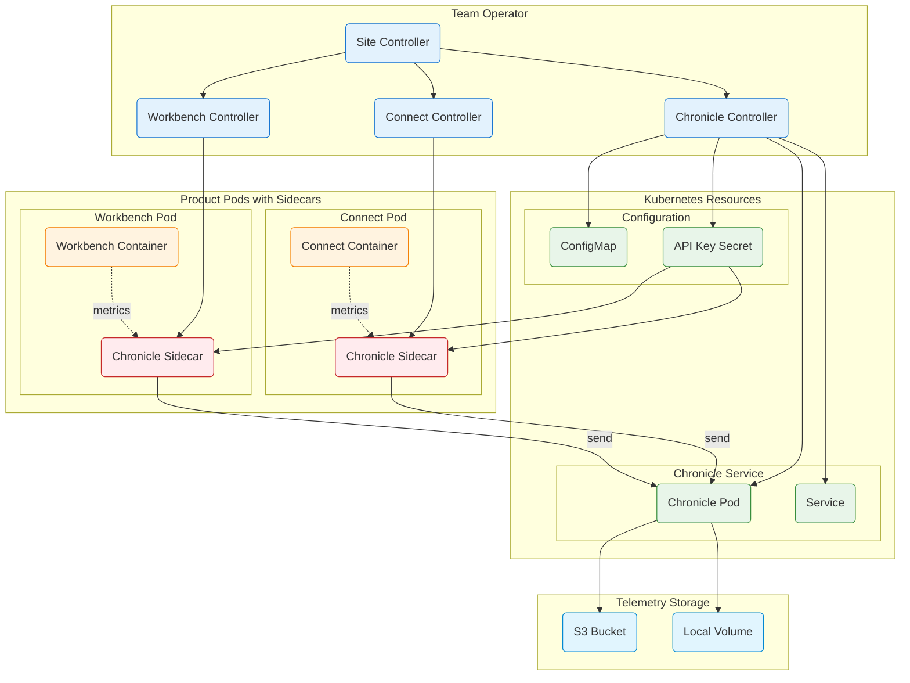

# Team Operator Architecture

This document provides detailed architecture diagrams and explanations for the Team Operator and its managed products.

## Table of Contents

- [System Overview](#system-overview)
- [Database Architecture](#database-architecture)
- [Connect Architecture](#connect-architecture)
- [Workbench Architecture](#workbench-architecture)
- [Package Manager Architecture](#package-manager-architecture)
- [Flightdeck Architecture](#flightdeck-architecture)
- [Chronicle Architecture](#chronicle-architecture)

---

## System Overview

The Team Operator follows the Kubernetes operator pattern: a Site Custom Resource (CR) serves as the single source of truth, and controllers reconcile the desired state into running Kubernetes resources.

```
User creates Site CR
        ↓
Site Controller reconciles
        ↓
Product CRs created (Connect, Workbench, PackageManager, etc.)
        ↓
Product Controllers reconcile
        ↓
Kubernetes resources created (Deployments, Services, Ingress, etc.)
```

### Key Concepts

| Concept | Description |
|---------|-------------|
| **Site CR** | The top-level resource that defines an entire Posit Team deployment |
| **Product CR** | Child resources (Connect, Workbench, PackageManager) created by the Site controller |
| **Controller** | Watches resources and reconciles them to the desired state |
| **Reconciliation** | The process of comparing desired state (CR spec) with actual state and making corrections |

---

## Database Architecture

Each Posit Team product requires database storage. The operator provisions separate databases with dedicated users and schemas.



### Component Descriptions

| Component | Description |
|-----------|-------------|
| **PublishDB** | PostgreSQL database for Connect. Stores published content metadata, user accounts, and access controls. |
| **Main Schema** | Primary data storage for the product (content, users, permissions) |
| **Instrumentation Schema** | Metrics and usage tracking data (Connect and Package Manager only) |
| **PackageDB** | PostgreSQL database for Package Manager. Stores package metadata, repository configurations, and sync state. |
| **Metrics Schema** | Analytics data for package downloads and repository usage |
| **DevDB** | PostgreSQL database for Workbench. Stores user sessions, project metadata, and launcher state. |
| **Public Schema** | Workbench uses a single schema for all data |

### Database User Isolation

Each product gets a dedicated database user with access only to its own schemas. This provides:
- **Security isolation**: Products cannot access each other's data
- **Resource tracking**: Database connections can be attributed to specific products
- **Independent credentials**: Rotating one product's credentials doesn't affect others

---

## Connect Architecture

Posit Connect is a publishing platform for data science content. The operator manages its deployment including off-host content execution.



### Component Descriptions

#### External Configuration (Coral)

| Component | Description |
|-----------|-------------|
| **Manual Setup** | One-time configuration performed by the administrator before deployment |
| **License** | Posit Connect license file or activation key, stored in a Kubernetes Secret or AWS Secrets Manager |
| **Auth Client Secret** | OIDC/SAML client credentials for SSO integration (client ID and secret from your IdP) |
| **Main DB Connection** | PostgreSQL connection string for the external database server |

#### Team Operator (Blue)

| Component | Description |
|-----------|-------------|
| **Site Controller** | Watches Site CRs and creates product-specific CRs (Connect, Workbench, etc.). Manages shared resources like PersistentVolumes. |
| **Database Controller** | Creates databases and schemas within the PostgreSQL server. Generates credentials and stores them in Secrets. |
| **Connect Controller** | Watches Connect CRs and creates all Kubernetes resources needed to run Connect. |

#### Kubernetes Resources (Green)

| Component | Description |
|-----------|-------------|
| **PersistentVolume (PV)** | Cluster-level storage resource representing physical storage (NFS, FSx, Azure NetApp) |
| **PersistentVolumeClaim (PVC)** | Namespace-scoped claim that binds to a PV. Mounted into the Connect pod for content storage. |
| **ConfigMaps** | Connect configuration files (`rstudio-connect.gcfg`) generated from the CR spec |
| **DB Password Secret** | Auto-generated database credentials created by the Database Controller |
| **Secret Key** | Encryption key for Connect's internal data encryption |
| **Connect Pod** | The main Connect server container running the publishing platform |
| **Ingress** | Routes external traffic to the Connect Service based on hostname |
| **Service** | Kubernetes Service providing stable networking for the Connect Pod |

### Off-Host Execution

When off-host execution is enabled, Connect runs content (Shiny apps, APIs, reports) in separate Kubernetes Jobs rather than in the main Connect pod. This provides:
- **Resource isolation**: Content processes don't compete with the Connect server
- **Scalability**: Content can scale independently
- **Security**: Content runs with minimal privileges

See the [Connect Configuration Guide](guides/connect-configuration.md) for details.

---

## Workbench Architecture

Posit Workbench provides IDE environments (RStudio, VS Code, Jupyter) for data scientists. The operator manages both the main server and user session pods.



### Component Descriptions

#### External Configuration (Coral)

Same as Connect - see [Connect Architecture](#component-descriptions) above.

#### Team Operator (Blue)

| Component | Description |
|-----------|-------------|
| **Site Controller** | Creates the Workbench CR and manages shared storage volumes |
| **Database Controller** | Provisions the Workbench database (DevDB) for session and project metadata |
| **Workbench Controller** | Creates all Kubernetes resources for Workbench including session templates |

#### Kubernetes Resources (Green)

| Component | Description |
|-----------|-------------|
| **PersistentVolume / PVC** | Shared project storage accessible by both the server and all session pods |
| **Home Directory PVC** | User home directories, mounted into session pods at `/home/{username}` |
| **ConfigMaps** | Workbench configuration files including `rserver.conf`, `launcher.conf`, and IDE settings |
| **Job Templates** | Kubernetes Job/Service templates used by the Launcher to create session pods |
| **Workbench Pod** | The main Workbench server handling authentication, the web UI, and session management |
| **Ingress / Service** | Network routing for external access to Workbench |

#### Session Infrastructure (Orange)

| Component | Description |
|-----------|-------------|
| **Job Launcher** | Component within Workbench that creates Kubernetes Jobs for user sessions |
| **Session Pod** | Individual IDE sessions (RStudio, VS Code, Jupyter) running as Kubernetes Jobs. Each user session gets its own pod with dedicated resources. |

### Session Lifecycle

1. User logs into Workbench and requests a new session
2. Job Launcher creates a Kubernetes Job using the configured template
3. Session Pod starts with the selected IDE and mounts user's home directory
4. User works in the session; all files are saved to persistent storage
5. When the session ends, the Job completes and the Pod is cleaned up
6. User's work persists in the Home Directory PVC for the next session

### Storage Architecture

Workbench requires careful storage planning:

| Storage | Purpose | Access Mode |
|---------|---------|-------------|
| **Home Directory PVC** | User home directories with personal files and settings | ReadWriteMany (multiple sessions) |
| **Shared Storage PVC** | Shared project data accessible by all users | ReadWriteMany |
| **Session Scratch** | Temporary storage for session runtime (optional) | ReadWriteOnce per session |

See the [Workbench Configuration Guide](guides/workbench-configuration.md) for details.

---

## Package Manager Architecture

Posit Package Manager provides a local repository for R and Python packages. It can mirror public repositories and host private packages.



### Component Descriptions

#### External Configuration (Coral)

| Component | Description |
|-----------|-------------|
| **Manual Setup** | One-time configuration by the administrator |
| **License** | Posit Package Manager license |
| **Auth Client Secret** | OIDC/SAML credentials for SSO |
| **Main DB Connection** | PostgreSQL connection for package metadata |
| **Git SSH Keys** | SSH keys for accessing private Git repositories when building packages from source |

#### Cloud Storage (Light Blue)

| Component | Description |
|-----------|-------------|
| **S3 Bucket** | AWS S3 storage for package binaries (recommended for AWS deployments) |
| **Azure Files** | Azure file storage for package binaries (recommended for Azure deployments) |

Package Manager can use either cloud storage backend. The choice typically depends on your cloud provider:
- **AWS**: Use S3 for best performance and cost
- **Azure**: Use Azure Files with the CSI driver
- **On-premises**: Use the local PVC for package storage

#### Team Operator (Blue)

| Component | Description |
|-----------|-------------|
| **Site Controller** | Creates the PackageManager CR |
| **Database Controller** | Provisions the Package Manager database with main and metrics schemas |
| **PackageManager Controller** | Creates all Kubernetes resources for Package Manager |

#### Kubernetes Resources (Green)

| Component | Description |
|-----------|-------------|
| **PersistentVolume / PVC** | Local storage for temporary files and cache (when not using cloud storage) |
| **ConfigMaps** | Package Manager configuration (`rstudio-pm.gcfg`) |
| **SSH Key Secret** | Mounted SSH keys for Git authentication during package builds |
| **Package Manager Pod** | The main server handling package requests, sync operations, and builds |
| **Ingress / Service** | Network routing for package installation requests |

### Package Storage Options

| Option | Best For | Configuration |
|--------|----------|---------------|
| **S3** | AWS deployments, large repositories | `spec.packageManager.s3Bucket` |
| **Azure Files** | Azure deployments | `spec.packageManager.azureFiles` |
| **Local PVC** | Development, small deployments | Default when no cloud storage configured |

### Git Builder Integration

Package Manager can build R packages from Git repositories. This requires:

1. **SSH Keys**: Private keys with access to your Git repositories
2. **Known Hosts**: SSH host key verification (optional but recommended)
3. **Build Resources**: CPU/memory for compilation

See the [Package Manager Configuration Guide](guides/packagemanager-configuration.md) for details.

---

## Flightdeck Architecture

Flightdeck is the landing page and navigation hub for Posit Team deployments. It provides a simple dashboard for users to access the various products.



### Component Descriptions

#### Team Operator (Blue)

| Component | Description |
|-----------|-------------|
| **Site Controller** | Creates the Flightdeck CR when Flightdeck is enabled in the Site spec |
| **Flightdeck Controller** | Creates all Kubernetes resources needed to run the landing page |

#### Kubernetes Resources (Green)

| Component | Description |
|-----------|-------------|
| **ConfigMap** | Configuration for Flightdeck including enabled features and product URLs |
| **Flightdeck Pod** | Static web server serving the landing page HTML/CSS/JS |
| **Ingress** | Routes traffic from the base domain to Flightdeck |
| **Service** | Kubernetes Service for the Flightdeck Pod |

#### Product Endpoints (Orange)

| Component | Description |
|-----------|-------------|
| **Workbench Ingress** | Flightdeck links to `workbench.{domain}` |
| **Connect Ingress** | Flightdeck links to `connect.{domain}` |
| **Package Manager Ingress** | Flightdeck links to `packagemanager.{domain}` |

### Features

Flightdeck is intentionally simple:

- **No database**: Serves static content only
- **No authentication**: Relies on product-level authentication
- **Configurable layout**: Shows only enabled products
- **Optional Academy**: Can display a fourth card for Posit Academy

### Configuration Options

| Option | Description |
|--------|-------------|
| `spec.flightdeck.replicas` | Number of replicas (default: 1) |
| `spec.flightdeck.featureEnabler.showConfig` | Show configuration page link |
| `spec.flightdeck.featureEnabler.showAcademy` | Show Academy product card |

---

## Chronicle Architecture

Chronicle is the telemetry and usage tracking service for Posit Team. It collects metrics from Connect and Workbench via sidecar containers.



### Component Descriptions

#### Team Operator (Blue)

| Component | Description |
|-----------|-------------|
| **Site Controller** | Creates the Chronicle CR when Chronicle is enabled |
| **Chronicle Controller** | Creates the Chronicle service and manages API keys |
| **Connect Controller** | Injects Chronicle sidecar into Connect pods when enabled |
| **Workbench Controller** | Injects Chronicle sidecar into Workbench pods when enabled |

#### Kubernetes Resources (Green)

| Component | Description |
|-----------|-------------|
| **ConfigMap** | Chronicle server configuration |
| **API Key Secret** | Shared secret for sidecar authentication to the Chronicle service |
| **Chronicle Pod** | Central telemetry aggregation service |
| **Service** | Internal endpoint for sidecars to send metrics |

#### Product Pods (Orange/Red)

| Component | Description |
|-----------|-------------|
| **Connect/Workbench Container** | Main product container that generates usage metrics |
| **Chronicle Sidecar** | Lightweight agent that collects metrics from the main container and forwards them to the Chronicle service |

#### Telemetry Storage (Light Blue)

| Component | Description |
|-----------|-------------|
| **S3 Bucket** | Cloud storage for telemetry data (recommended for production) |
| **Local Volume** | Local storage option for development or air-gapped environments |

### Data Flow

1. **Metrics Generation**: Connect and Workbench generate usage metrics (content views, session starts, etc.)
2. **Sidecar Collection**: Chronicle sidecars collect metrics from the product containers
3. **Aggregation**: Sidecars send data to the central Chronicle service
4. **Storage**: Chronicle persists data to S3 or local storage
5. **Analysis**: Data can be queried for usage reports and analytics

### Sidecar Injection

The Chronicle sidecar is automatically injected into product pods when:
- Chronicle is enabled in the Site spec (`spec.chronicle.enabled: true`)
- The product has Chronicle integration enabled

The sidecar:
- Runs as a secondary container in the same pod
- Shares the pod's network namespace (can reach localhost)
- Uses the API key secret for authentication
- Has minimal resource requirements (~50Mi memory)

### Configuration Options

| Option | Description |
|--------|-------------|
| `spec.chronicle.enabled` | Enable Chronicle telemetry collection |
| `spec.chronicle.image` | Chronicle agent container image |
| `spec.chronicle.s3Bucket` | S3 bucket for telemetry storage |
| `spec.chronicle.localStorage` | Use local volume instead of S3 |

---

## Related Documentation

- [Site Management Guide](guides/product-team-site-management.md) - Managing Site CRs
- [Connect Configuration](guides/connect-configuration.md) - Detailed Connect setup
- [Workbench Configuration](guides/workbench-configuration.md) - Detailed Workbench setup
- [Package Manager Configuration](guides/packagemanager-configuration.md) - Detailed Package Manager setup
- [API Reference](api-reference.md) - Complete CRD field reference
