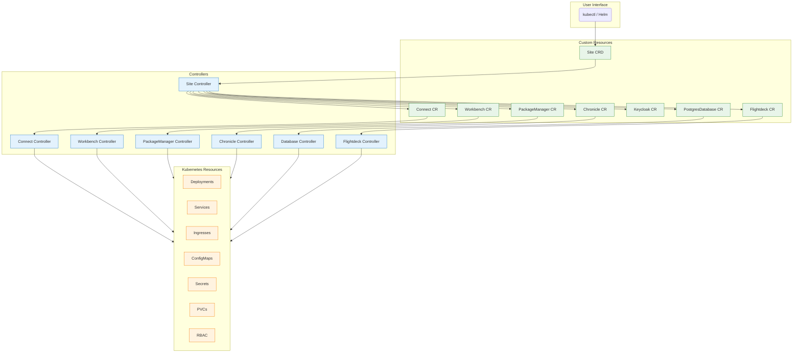
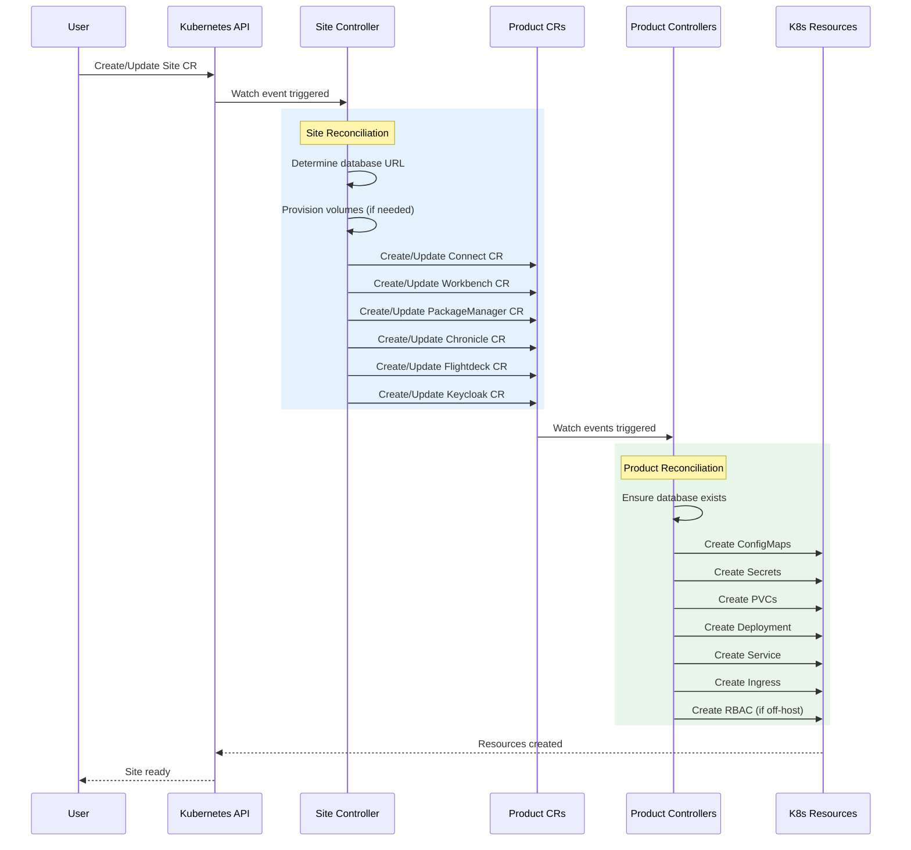
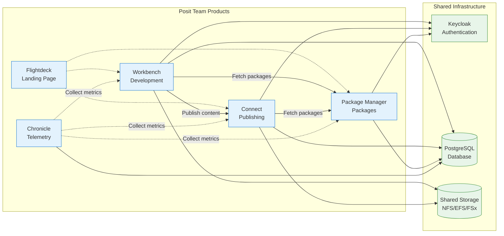
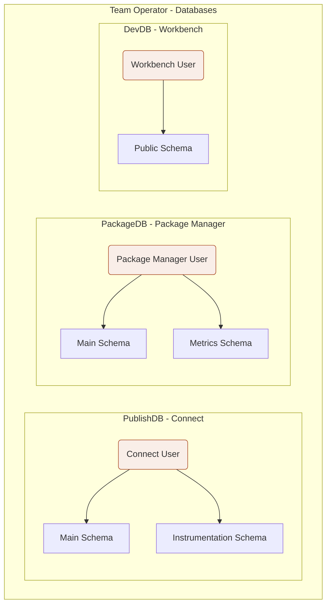
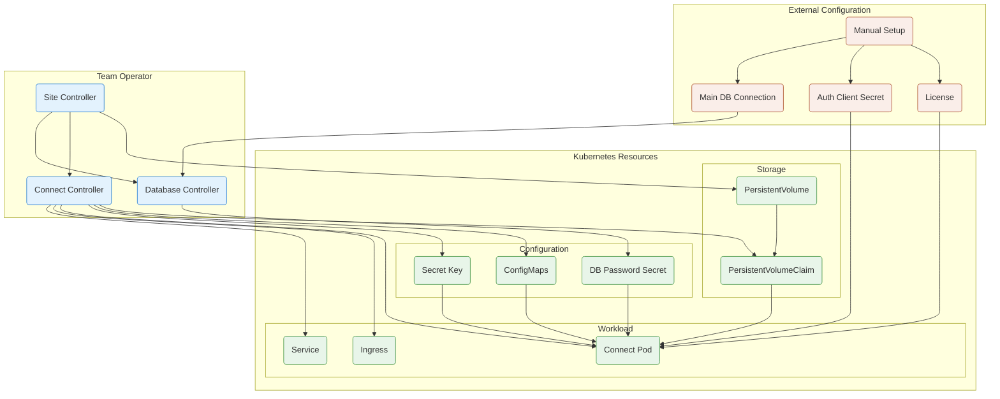
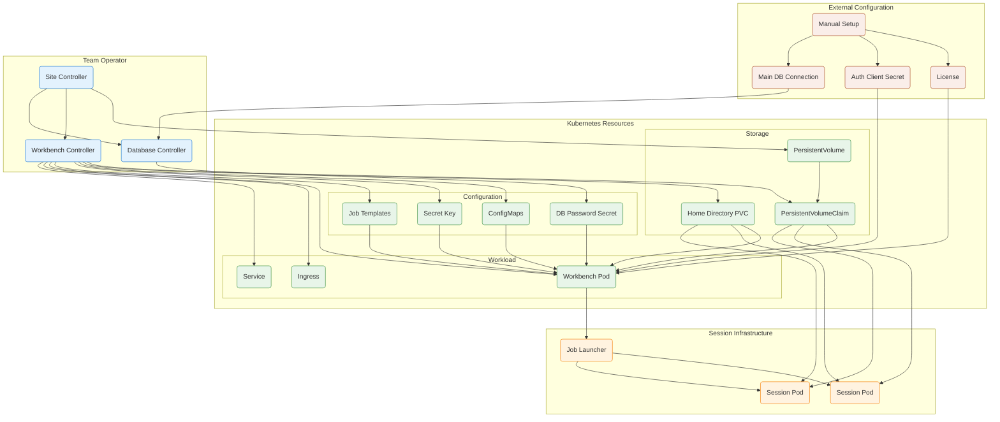
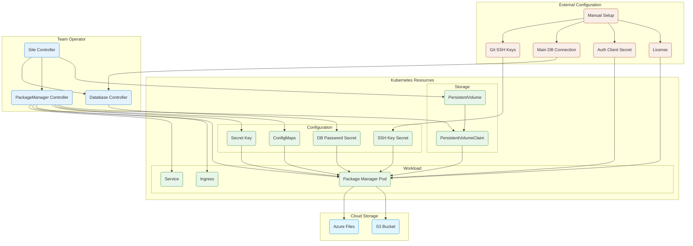
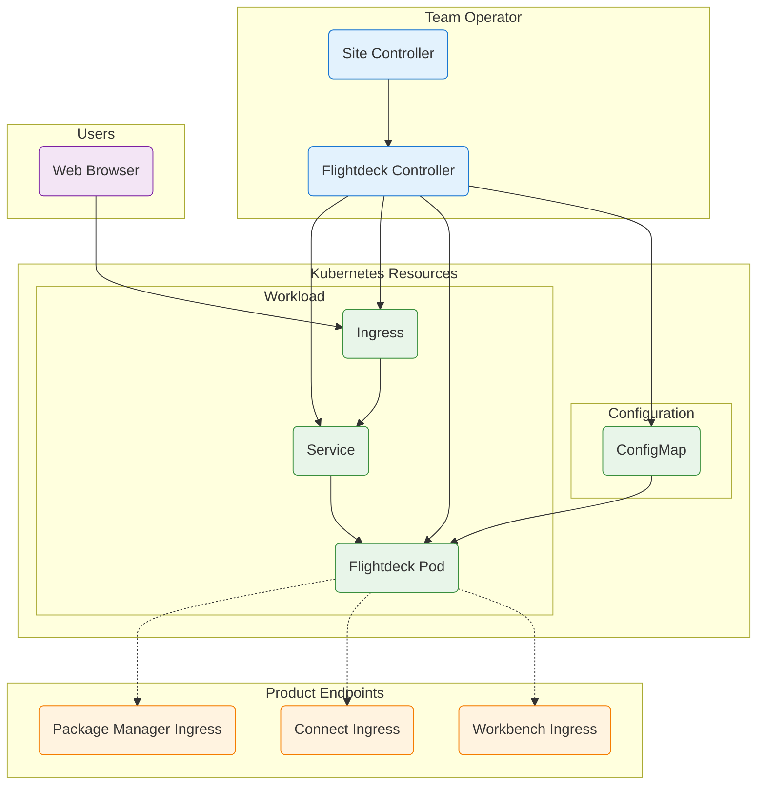
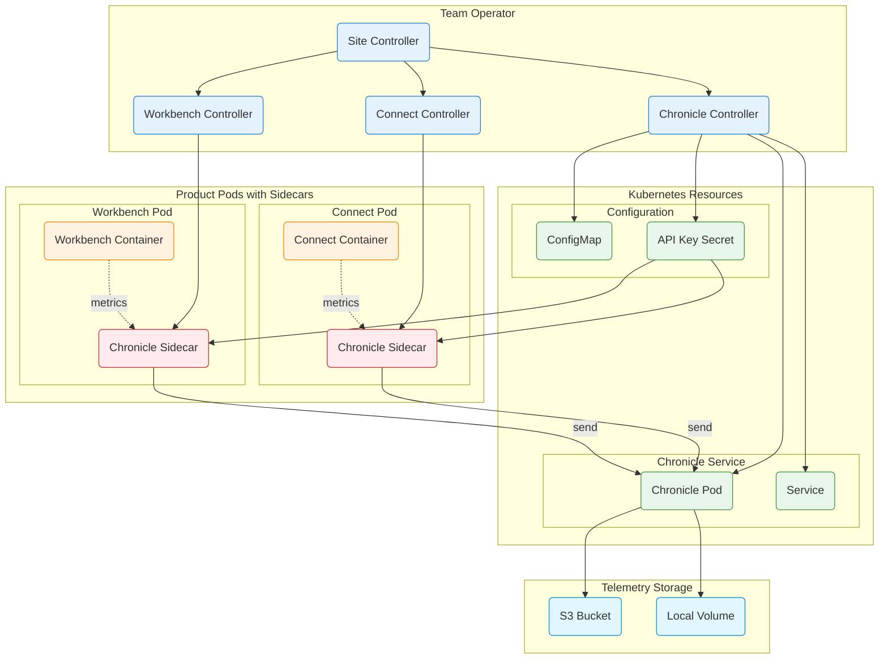

# Team Operator Architecture

This document covers the architecture of Team Operator and each of the products it manages. Each section describes the relevant components, shows a diagram of how they interact, and calls out the details that matter most for operating or extending the system.

## Table of Contents

- [System Overview](#system-overview)
- [Database Architecture](#database-architecture)
- [Connect Architecture](#connect-architecture)
- [Workbench Architecture](#workbench-architecture)
- [Package Manager Architecture](#package-manager-architecture)
- [Flightdeck Architecture](#flightdeck-architecture)
- [Chronicle Architecture](#chronicle-architecture)

---

## System Overview

Team Operator follows the standard Kubernetes operator pattern: you declare desired state in a Custom Resource, and controllers continuously reconcile actual state to match it. The top-level resource is the `Site` CR, which acts as the single source of truth for an entire Posit Team deployment. When you create or update a Site, the Site controller fans out product-specific CRs — one per enabled product — and each product controller then manages its own Kubernetes resources independently.

The following key concepts underpin all of the more detailed diagrams in this document:

| Concept | Description |
|---------|-------------|
| **Site CR** | The top-level resource that defines an entire Posit Team deployment |
| **Product CR** | Child resources (Connect, Workbench, PackageManager, etc.) created by the Site controller |
| **Controller** | Watches resources and reconciles them to the desired state |
| **Reconciliation** | The process of comparing desired state (CR spec) with actual state and making corrections |

The diagram below shows the full flow from a user applying a Site CR through to running Kubernetes resources. The three-tier structure — Custom Resources, Controllers, Kubernetes Resources — applies consistently to every product in the system.

```mermaid
flowchart TB
    subgraph user [User Interface]
        kubectl(kubectl / Helm)
    end

    subgraph crd [Custom Resources]
        site[Site CRD]
        connect_cr[Connect CR]
        workbench_cr[Workbench CR]
        pm_cr[PackageManager CR]
        chronicle_cr[Chronicle CR]
        keycloak_cr[Keycloak CR]
        flightdeck_cr[Flightdeck CR]
        pgdb_cr[PostgresDatabase CR]
    end

    subgraph controllers [Controllers]
        site_ctrl[Site Controller]
        connect_ctrl[Connect Controller]
        workbench_ctrl[Workbench Controller]
        pm_ctrl[PackageManager Controller]
        chronicle_ctrl[Chronicle Controller]
        db_ctrl[Database Controller]
        flightdeck_ctrl[Flightdeck Controller]
    end

    subgraph k8s [Kubernetes Resources]
        deployments[Deployments]
        services[Services]
        ingresses[Ingresses]
        configmaps[ConfigMaps]
        secrets[Secrets]
        pvcs[PVCs]
        rbac[RBAC]
    end

    %% User creates Site
    kubectl --> site

    %% Site controller creates product CRs
    site --> site_ctrl
    site_ctrl --> connect_cr
    site_ctrl --> workbench_cr
    site_ctrl --> pm_cr
    site_ctrl --> chronicle_cr
    site_ctrl --> keycloak_cr
    site_ctrl --> flightdeck_cr
    site_ctrl --> pgdb_cr

    %% Product controllers watch CRs
    connect_cr --> connect_ctrl
    workbench_cr --> workbench_ctrl
    pm_cr --> pm_ctrl
    chronicle_cr --> chronicle_ctrl
    pgdb_cr --> db_ctrl
    flightdeck_cr --> flightdeck_ctrl

    %% Controllers create K8s resources
    connect_ctrl --> k8s
    workbench_ctrl --> k8s
    pm_ctrl --> k8s
    chronicle_ctrl --> k8s
    db_ctrl --> k8s
    flightdeck_ctrl --> k8s

    classDef crdStyle fill:#E8F5E9,stroke:#388E3C
    classDef ctrlStyle fill:#E3F2FD,stroke:#1976D2
    classDef k8sStyle fill:#FFF3E0,stroke:#F57C00

    class site,connect_cr,workbench_cr,pm_cr,chronicle_cr,keycloak_cr,flightdeck_cr,pgdb_cr crdStyle
    class site_ctrl,connect_ctrl,workbench_ctrl,pm_ctrl,chronicle_ctrl,db_ctrl,flightdeck_ctrl ctrlStyle
    class deployments,services,ingresses,configmaps,secrets,pvcs,rbac k8sStyle
```

The Site controller is the orchestration layer: it determines which products are enabled, resolves shared configuration (database URLs, storage volumes), and creates or updates product CRs accordingly. Product controllers are deliberately isolated — each one only knows about its own CR and is responsible for driving its product to a healthy running state.

### Reconciliation Flow

Understanding the order of operations during reconciliation helps when diagnosing problems. The sequence diagram below shows what happens from the moment you apply a change to a Site CR through to running product resources. The two colored blocks represent the Site and product reconciliation phases, which happen independently and can run concurrently for different products.

```mermaid
sequenceDiagram
    participant User
    participant K8s as Kubernetes API
    participant SiteCtrl as Site Controller
    participant ProductCR as Product CRs
    participant ProductCtrl as Product Controllers
    participant Resources as K8s Resources

    User->>K8s: Create/Update Site CR
    K8s->>SiteCtrl: Watch event triggered

    rect rgb(227, 242, 253)
        Note over SiteCtrl: Site Reconciliation
        SiteCtrl->>SiteCtrl: Determine database URL
        SiteCtrl->>SiteCtrl: Provision volumes (if needed)
        SiteCtrl->>ProductCR: Create/Update Connect CR
        SiteCtrl->>ProductCR: Create/Update Workbench CR
        SiteCtrl->>ProductCR: Create/Update PackageManager CR
        SiteCtrl->>ProductCR: Create/Update Chronicle CR
        SiteCtrl->>ProductCR: Create/Update Flightdeck CR
        SiteCtrl->>ProductCR: Create/Update Keycloak CR
    end

    ProductCR->>ProductCtrl: Watch events triggered

    rect rgb(232, 245, 233)
        Note over ProductCtrl: Product Reconciliation
        ProductCtrl->>ProductCtrl: Ensure database exists
        ProductCtrl->>Resources: Create ConfigMaps
        ProductCtrl->>Resources: Create Secrets
        ProductCtrl->>Resources: Create PVCs
        ProductCtrl->>Resources: Create Deployment
        ProductCtrl->>Resources: Create Service
        ProductCtrl->>Resources: Create Ingress
        ProductCtrl->>Resources: Create RBAC (if off-host)
    end

    Resources-->>K8s: Resources created
    K8s-->>User: Site ready
```

A key property of this design is that product controllers are idempotent — they can safely re-run at any time and will converge to the desired state without side effects. If a product CR is updated (because you changed the Site spec), the product controller reconciles again and applies only the delta.

### Component Relationships

The products in a Posit Team deployment are not fully independent — they share infrastructure and integrate with each other. The diagram below shows the runtime relationships between products and the shared services they depend on.

```mermaid
flowchart LR
    subgraph products [Posit Team Products]
        flightdeck[Flightdeck<br/>Landing Page]
        workbench[Workbench<br/>Development]
        connect[Connect<br/>Publishing]
        pm[Package Manager<br/>Packages]
        chronicle[Chronicle<br/>Telemetry]
    end

    subgraph shared [Shared Infrastructure]
        keycloak[Keycloak<br/>Authentication]
        postgres[(PostgreSQL<br/>Database)]
        storage[(Shared Storage<br/>NFS/EFS/FSx)]
    end

    %% Landing page links to products
    flightdeck -.-> workbench
    flightdeck -.-> connect
    flightdeck -.-> pm

    %% Product interactions
    workbench -->|Publish content| connect
    workbench -->|Fetch packages| pm
    connect -->|Fetch packages| pm

    %% Shared infrastructure
    workbench --> keycloak
    connect --> keycloak
    pm --> keycloak

    workbench --> postgres
    connect --> postgres
    pm --> postgres
    chronicle --> postgres

    workbench --> storage
    connect --> storage

    %% Chronicle collects from products
    chronicle -.->|Collect metrics| workbench
    chronicle -.->|Collect metrics| connect
    chronicle -.->|Collect metrics| pm

    classDef product fill:#E3F2FD,stroke:#1976D2
    classDef infra fill:#E8F5E9,stroke:#388E3C

    class flightdeck,workbench,connect,pm,chronicle product
    class keycloak,postgres,storage infra
```

PostgreSQL and shared storage are used by multiple products, and Keycloak provides SSO authentication for all three primary products. This shared infrastructure is why the Site CR exists: a single resource can enforce consistent configuration (same database host, same domain, same auth settings) across everything.

The sections below detail each product's internal architecture. Database provisioning is covered first because it is a prerequisite for Connect, Workbench, and Package Manager.

---

## Database Architecture

Connect, Workbench, and Package Manager each require a PostgreSQL database. Rather than sharing a single database, the operator provisions separate databases with dedicated users so that each product has isolated credentials, schemas, and connection pools.

The diagram below shows the three databases — PublishDB (Connect), PackageDB (Package Manager), and DevDB (Workbench) — and the schemas within each. The color highlights database users, which are created with access only to their own product's schemas.

```mermaid
flowchart TB
    subgraph db [Team Operator - Databases]
        subgraph pub[PublishDB - Connect]
            pub-user(Connect User)
            pub-main[Main Schema]
            pub-metrics[Instrumentation Schema]
        end
        pub-user-->pub-main
        pub-user-->pub-metrics

        subgraph pkg[PackageDB - Package Manager]
            pkg-user(Package Manager User)
            pkg-main[Main Schema]
            pkg-metrics[Metrics Schema]
        end
        pkg-user-->pkg-main
        pkg-user-->pkg-metrics

        subgraph dev[DevDB - Workbench]
            dev-user(Workbench User)
            dev-main[Public Schema]
        end
        dev-user-->dev-main
    end

    classDef userNode fill:#FAEEE9,stroke:#ab4d26
    class pub-user,pkg-user,dev-user userNode
```

The isolation between database users is intentional: products cannot access each other's data, you can attribute database connections to a specific product, and rotating credentials for one product does not affect the others. The Database Controller handles provisioning — it creates the database, user, and schemas, then stores the generated credentials in a Kubernetes Secret that the product controller mounts into the product pod.

### Component Descriptions

| Component | Description |
|-----------|-------------|
| **PublishDB** | PostgreSQL database for Connect. Stores published content metadata, user accounts, and access controls. |
| **Main Schema** | Primary data storage for the product (content, users, permissions) |
| **Instrumentation Schema** | Metrics and usage tracking data (Connect and Package Manager only) |
| **PackageDB** | PostgreSQL database for Package Manager. Stores package metadata, repository configurations, and sync state. |
| **Metrics Schema** | Analytics data for package downloads and repository usage |
| **DevDB** | PostgreSQL database for Workbench. Stores user sessions, project metadata, and launcher state. |
| **Public Schema** | Workbench uses a single schema for all data |

---

## Connect Architecture

Posit Connect is a publishing platform for data science content — Shiny apps, R Markdown reports, Jupyter notebooks, APIs, and more. The operator manages Connect's deployment including its optional off-host content execution mode, where content runs in separate Kubernetes Jobs instead of the main Connect pod.

The diagram below shows the complete set of inputs, operator components, and Kubernetes resources involved in running Connect. Items in coral require one-time manual setup by an administrator before deployment. The operator handles everything in blue and green.

```mermaid
flowchart TB
    subgraph external [External Configuration]
        manual(Manual Setup)
        license(License)
        clientsecret(Auth Client Secret)
        mainDbCon(Main DB Connection)
    end

    subgraph operator [Team Operator]
        site(Site Controller)
        dbcon(Database Controller)
        connect(Connect Controller)
    end

    subgraph k8s [Kubernetes Resources]
        subgraph storage [Storage]
            pv(PersistentVolume)
            pvc(PersistentVolumeClaim)
        end
        subgraph config [Configuration]
            cm(ConfigMaps)
            dbsecret(DB Password Secret)
            secretkey(Secret Key)
        end
        subgraph workload [Workload]
            pubdeploy(Connect Pod)
            ing(Ingress)
            svc(Service)
        end
    end

    %% External to Operator
    manual --> license
    manual --> clientsecret
    manual --> mainDbCon
    mainDbCon --> dbcon

    %% Operator flow
    site --> pv
    site --> connect
    site --> dbcon
    dbcon --> dbsecret

    %% Connect Controller creates resources
    connect --> pvc
    connect --> cm
    connect --> secretkey
    connect --> pubdeploy
    connect --> ing
    connect --> svc

    %% Resources flow to Pod
    pv --> pvc
    pvc --> pubdeploy
    cm --> pubdeploy
    dbsecret --> pubdeploy
    secretkey --> pubdeploy
    license --> pubdeploy
    clientsecret --> pubdeploy

    classDef external fill:#FAEEE9,stroke:#ab4d26
    classDef operator fill:#E3F2FD,stroke:#1976D2
    classDef k8s fill:#E8F5E9,stroke:#388E3C

    class manual,license,clientsecret,mainDbCon external
    class site,dbcon,connect operator
    class pv,pvc,cm,dbsecret,secretkey,pubdeploy,ing,svc k8s
```

The Connect pod assembles configuration from several sources: the `rstudio-connect.gcfg` ConfigMap (generated from the Site CR spec), the database credentials Secret (created by the Database Controller), the encryption Secret Key, and the externally-managed license and auth client secret. All of these must be present before the Connect pod will start successfully.

### Component Descriptions

#### External Configuration (Coral)

| Component | Description |
|-----------|-------------|
| **Manual Setup** | One-time configuration an administrator performs before deployment |
| **License** | Posit Connect license file or activation key, stored in a Kubernetes Secret or AWS Secrets Manager |
| **Auth Client Secret** | OIDC/SAML client credentials for SSO integration (client ID and secret from your IdP) |
| **Main DB Connection** | PostgreSQL connection string for the external database server |

#### Team Operator (Blue)

| Component | Description |
|-----------|-------------|
| **Site Controller** | Watches Site CRs and creates product-specific CRs. Manages shared resources like PersistentVolumes. |
| **Database Controller** | Creates databases and schemas in the PostgreSQL server. Generates credentials and stores them in Secrets. |
| **Connect Controller** | Watches Connect CRs and creates all Kubernetes resources Connect needs. |

#### Kubernetes Resources (Green)

| Component | Description |
|-----------|-------------|
| **PersistentVolume (PV)** | Cluster-level storage resource that represents physical storage (NFS, FSx, Azure NetApp) |
| **PersistentVolumeClaim (PVC)** | Namespace-scoped claim that binds to a PV. Mounts into the Connect pod for content storage. |
| **ConfigMaps** | Connect configuration files (`rstudio-connect.gcfg`) generated from the CR spec |
| **DB Password Secret** | Auto-generated database credentials the Database Controller creates |
| **Secret Key** | Encryption key for Connect's internal data encryption |
| **Connect Pod** | The main Connect server container that runs the publishing platform |
| **Ingress** | Routes external traffic to the Connect Service by hostname |
| **Service** | Kubernetes Service that provides stable networking for the Connect Pod |

### Off-Host Execution

When off-host execution is enabled, Connect runs content (Shiny apps, APIs, reports) in separate Kubernetes Jobs instead of the main Connect pod. Content processes no longer compete with the Connect server for resources, they can scale independently, and they run with minimal privileges. See the [Connect Configuration Guide](guides/connect-configuration.md) for details.

---

## Workbench Architecture

Posit Workbench provides interactive IDE environments — RStudio, VS Code, and Jupyter — for data scientists. Its architecture is notably different from Connect and Package Manager because each user session runs as an independent Kubernetes Job pod, not a process inside the main server.

Workbench shares the same external configuration requirements as Connect (license, auth client secret, database connection), with one addition: a home directory PVC that persists user files across sessions. The diagram below shows both the main Workbench deployment and the session infrastructure it manages.

```mermaid
flowchart TB
    subgraph external [External Configuration]
        manual(Manual Setup)
        license(License)
        clientsecret(Auth Client Secret)
        mainDbCon(Main DB Connection)
    end

    subgraph operator [Team Operator]
        site(Site Controller)
        dbcon(Database Controller)
        workbench(Workbench Controller)
    end

    subgraph k8s [Kubernetes Resources]
        subgraph storage [Storage]
            pv(PersistentVolume)
            pvc(PersistentVolumeClaim)
            homepvc(Home Directory PVC)
        end
        subgraph config [Configuration]
            cm(ConfigMaps)
            dbsecret(DB Password Secret)
            secretkey(Secret Key)
            jobtpl(Job Templates)
        end
        subgraph workload [Workload]
            wbdeploy(Workbench Pod)
            ing(Ingress)
            svc(Service)
        end
    end

    subgraph sessions [Session Infrastructure]
        launcher(Job Launcher)
        sessionpod1(Session Pod)
        sessionpod2(Session Pod)
    end

    %% External to Operator
    manual --> license
    manual --> clientsecret
    manual --> mainDbCon
    mainDbCon --> dbcon

    %% Operator flow
    site --> pv
    site --> workbench
    site --> dbcon
    dbcon --> dbsecret

    %% Workbench Controller creates resources
    workbench --> pvc
    workbench --> homepvc
    workbench --> cm
    workbench --> secretkey
    workbench --> jobtpl
    workbench --> wbdeploy
    workbench --> ing
    workbench --> svc

    %% Resources flow to Pod
    pv --> pvc
    pvc --> wbdeploy
    homepvc --> wbdeploy
    cm --> wbdeploy
    dbsecret --> wbdeploy
    secretkey --> wbdeploy
    license --> wbdeploy
    clientsecret --> wbdeploy
    jobtpl --> wbdeploy

    %% Session management
    wbdeploy --> launcher
    launcher --> sessionpod1
    launcher --> sessionpod2
    homepvc --> sessionpod1
    homepvc --> sessionpod2
    pvc --> sessionpod1
    pvc --> sessionpod2

    classDef external fill:#FAEEE9,stroke:#ab4d26
    classDef operator fill:#E3F2FD,stroke:#1976D2
    classDef k8s fill:#E8F5E9,stroke:#388E3C
    classDef session fill:#FFF3E0,stroke:#F57C00

    class manual,license,clientsecret,mainDbCon external
    class site,dbcon,workbench operator
    class pv,pvc,homepvc,cm,dbsecret,secretkey,jobtpl,wbdeploy,ing,svc k8s
    class launcher,sessionpod1,sessionpod2 session
```

The Job Launcher component — running inside the Workbench pod — is what creates and manages session pods. It uses Kubernetes Job Templates (ConfigMaps) to define how sessions are created, and it communicates with the Kubernetes API directly to schedule new pods. Both the Workbench server and all session pods mount the same Home Directory PVC, which is what allows user files to persist between sessions and be accessible from any pod.

### Component Descriptions

#### Team Operator (Blue)

| Component | Description |
|-----------|-------------|
| **Site Controller** | Creates the Workbench CR and manages shared storage volumes |
| **Database Controller** | Provisions the Workbench database (DevDB) for session and project metadata |
| **Workbench Controller** | Creates all Kubernetes resources for Workbench including session templates |

#### Kubernetes Resources (Green)

| Component | Description |
|-----------|-------------|
| **PersistentVolume / PVC** | Shared project storage the server and all session pods can access |
| **Home Directory PVC** | User home directories, mounted into session pods at `/home/{username}` |
| **ConfigMaps** | Workbench configuration files: `rserver.conf`, `launcher.conf`, and IDE settings |
| **Job Templates** | Kubernetes Job/Service templates the Launcher uses to create session pods |
| **Workbench Pod** | The main Workbench server that handles authentication, the web UI, and session management |
| **Ingress / Service** | Network routing for external access to Workbench |

#### Session Infrastructure (Orange)

| Component | Description |
|-----------|-------------|
| **Job Launcher** | Component in Workbench that creates Kubernetes Jobs for user sessions |
| **Session Pod** | Individual IDE sessions (RStudio, VS Code, Jupyter) running as Kubernetes Jobs. Each user session gets its own pod with dedicated resources. |

### Session Lifecycle

1. User logs into Workbench and requests a new session
2. Job Launcher creates a Kubernetes Job from the configured template
3. Session Pod starts with the selected IDE and mounts the user's home directory
4. User works in the session. All files save to persistent storage
5. When the session ends, the Job completes and the Pod is cleaned up
6. The user's work persists in the Home Directory PVC for the next session

### Storage Architecture

Workbench requires careful storage planning. All PVCs used by sessions must support `ReadWriteMany` access mode so multiple pods can mount them simultaneously.

| Storage | Purpose | Access Mode |
|---------|---------|-------------|
| **Home Directory PVC** | User home directories with personal files and settings | ReadWriteMany (multiple sessions) |
| **Shared Storage PVC** | Shared project data accessible by all users | ReadWriteMany |
| **Session Scratch** | Temporary storage for session runtime (optional) | ReadWriteOnce per session |

See the [Workbench Configuration Guide](guides/workbench-configuration.md) for details.

---

## Package Manager Architecture

Posit Package Manager provides a local repository for R and Python packages. It can mirror public repositories (CRAN, PyPI, Bioconductor), host private packages, and build packages from Git repositories. Package Manager is the package source that both Workbench and Connect are typically configured to use, which is why it appears in the component relationships diagram as a shared dependency.

Package Manager's architecture is similar to Connect's, with two notable differences: it can use cloud object storage (S3 or Azure Files) for package binaries instead of a local PVC, and it may require SSH keys if you configure Git-based package builds.

```mermaid
flowchart TB
    subgraph external [External Configuration]
        manual(Manual Setup)
        license(License)
        clientsecret(Auth Client Secret)
        mainDbCon(Main DB Connection)
        sshkeys(Git SSH Keys)
    end

    subgraph cloudstorage [Cloud Storage]
        s3(S3 Bucket)
        azfiles(Azure Files)
    end

    subgraph operator [Team Operator]
        site(Site Controller)
        dbcon(Database Controller)
        pm(PackageManager Controller)
    end

    subgraph k8s [Kubernetes Resources]
        subgraph storage [Storage]
            pv(PersistentVolume)
            pvc(PersistentVolumeClaim)
        end
        subgraph config [Configuration]
            cm(ConfigMaps)
            dbsecret(DB Password Secret)
            secretkey(Secret Key)
            sshsecret(SSH Key Secret)
        end
        subgraph workload [Workload]
            pmdeploy(Package Manager Pod)
            ing(Ingress)
            svc(Service)
        end
    end

    %% External to Operator
    manual --> license
    manual --> clientsecret
    manual --> mainDbCon
    manual --> sshkeys
    mainDbCon --> dbcon
    sshkeys --> sshsecret

    %% Operator flow
    site --> pv
    site --> pm
    site --> dbcon
    dbcon --> dbsecret

    %% PackageManager Controller creates resources
    pm --> pvc
    pm --> cm
    pm --> secretkey
    pm --> pmdeploy
    pm --> ing
    pm --> svc

    %% Resources flow to Pod
    pv --> pvc
    pvc --> pmdeploy
    cm --> pmdeploy
    dbsecret --> pmdeploy
    secretkey --> pmdeploy
    license --> pmdeploy
    clientsecret --> pmdeploy
    sshsecret --> pmdeploy

    %% Cloud storage connections
    pmdeploy --> s3
    pmdeploy --> azfiles

    classDef external fill:#FAEEE9,stroke:#ab4d26
    classDef operator fill:#E3F2FD,stroke:#1976D2
    classDef k8s fill:#E8F5E9,stroke:#388E3C
    classDef cloud fill:#E1F5FE,stroke:#0288D1

    class manual,license,clientsecret,mainDbCon,sshkeys external
    class site,dbcon,pm operator
    class pv,pvc,cm,dbsecret,secretkey,sshsecret,pmdeploy,ing,svc k8s
    class s3,azfiles cloud
```

Package binaries — the actual `.tar.gz` and `.whl` files — can be large. For production deployments, storing them in cloud object storage rather than a local PVC avoids capacity constraints and simplifies multi-replica deployments. The local PVC remains available as a default for development or air-gapped environments.

### Component Descriptions

#### External Configuration (Coral)

| Component | Description |
|-----------|-------------|
| **Manual Setup** | One-time configuration by the administrator |
| **License** | Posit Package Manager license |
| **Auth Client Secret** | OIDC/SAML credentials for SSO |
| **Main DB Connection** | PostgreSQL connection for package metadata |
| **Git SSH Keys** | SSH keys for accessing private Git repositories when building packages from source |

#### Cloud Storage (Light Blue)

| Component | Description |
|-----------|-------------|
| **S3 Bucket** | AWS S3 storage for package binaries (recommended for AWS) |
| **Azure Files** | Azure file storage for package binaries (recommended for Azure) |

#### Team Operator (Blue)

| Component | Description |
|-----------|-------------|
| **Site Controller** | Creates the PackageManager CR |
| **Database Controller** | Provisions the Package Manager database with main and metrics schemas |
| **PackageManager Controller** | Creates all Kubernetes resources for Package Manager |

#### Kubernetes Resources (Green)

| Component | Description |
|-----------|-------------|
| **PersistentVolume / PVC** | Local storage for temporary files and cache (when not using cloud storage) |
| **ConfigMaps** | Package Manager configuration (`rstudio-pm.gcfg`) |
| **SSH Key Secret** | Mounted SSH keys for Git authentication during package builds |
| **Package Manager Pod** | The main server that handles package requests, sync operations, and builds |
| **Ingress / Service** | Network routing for package installation requests |

### Package Storage Options

| Option | Best For | Configuration |
|--------|----------|---------------|
| **S3** | AWS deployments, large repositories | `spec.packageManager.s3Bucket` |
| **Azure Files** | Azure deployments | `spec.packageManager.azureFiles` |
| **Local PVC** | Development, small deployments | Default when no cloud storage configured |

### Git Builder Integration

Package Manager can build R packages from Git repositories. This requires SSH keys with access to your repositories, optional SSH host key verification, and sufficient CPU and memory allocated for compilation. See the [Package Manager Configuration Guide](guides/packagemanager-configuration.md) for details.

---

## Flightdeck Architecture

Flightdeck is the landing page and navigation hub for a Posit Team deployment. It is intentionally simple — a static web server with no database and no authentication of its own — that provides users with a single URL to reach all products in the deployment.

Because Flightdeck has no dependencies on the Database Controller and requires no external credentials, its architecture is the most straightforward of the product components. The diagram below reflects that simplicity.

```mermaid
flowchart TB
    subgraph operator [Team Operator]
        site(Site Controller)
        flightdeck_ctrl(Flightdeck Controller)
    end

    subgraph k8s [Kubernetes Resources]
        subgraph config [Configuration]
            cm(ConfigMap)
        end
        subgraph workload [Workload]
            fddeploy(Flightdeck Pod)
            ing(Ingress)
            svc(Service)
        end
    end

    subgraph products [Product Endpoints]
        wb_ing(Workbench Ingress)
        conn_ing(Connect Ingress)
        pm_ing(Package Manager Ingress)
    end

    subgraph users [Users]
        browser(Web Browser)
    end

    %% Operator flow
    site --> flightdeck_ctrl
    flightdeck_ctrl --> cm
    flightdeck_ctrl --> fddeploy
    flightdeck_ctrl --> ing
    flightdeck_ctrl --> svc

    %% Config to Pod
    cm --> fddeploy

    %% User access
    browser --> ing
    ing --> svc
    svc --> fddeploy

    %% Navigation to products
    fddeploy -.-> wb_ing
    fddeploy -.-> conn_ing
    fddeploy -.-> pm_ing

    classDef operator fill:#E3F2FD,stroke:#1976D2
    classDef k8s fill:#E8F5E9,stroke:#388E3C
    classDef product fill:#FFF3E0,stroke:#F57C00
    classDef user fill:#F3E5F5,stroke:#7B1FA2

    class site,flightdeck_ctrl operator
    class cm,fddeploy,ing,svc k8s
    class wb_ing,conn_ing,pm_ing product
    class browser user
```

The Flightdeck pod renders its landing page using configuration from a single ConfigMap, which the Flightdeck Controller generates from the Site spec. The dashed arrows to product ingresses represent client-side navigation links — Flightdeck does not proxy traffic to those products, it simply links to them.

### Component Descriptions

#### Team Operator (Blue)

| Component | Description |
|-----------|-------------|
| **Site Controller** | Creates the Flightdeck CR when Flightdeck is enabled in the Site spec |
| **Flightdeck Controller** | Creates all Kubernetes resources needed to run the landing page |

#### Kubernetes Resources (Green)

| Component | Description |
|-----------|-------------|
| **ConfigMap** | Configuration for Flightdeck: enabled features and product URLs |
| **Flightdeck Pod** | Static web server that serves the landing page HTML/CSS/JS |
| **Ingress** | Routes traffic from the base domain to Flightdeck |
| **Service** | Kubernetes Service for the Flightdeck Pod |

#### Product Endpoints (Orange)

| Component | Description |
|-----------|-------------|
| **Workbench Ingress** | Flightdeck links to `workbench.{domain}` |
| **Connect Ingress** | Flightdeck links to `connect.{domain}` |
| **Package Manager Ingress** | Flightdeck links to `packagemanager.{domain}` |

### Configuration Options

Flightdeck shows only the products that are enabled in the Site spec. A fourth card for Posit Academy can optionally be displayed.

| Option | Description |
|--------|-------------|
| `spec.flightdeck.replicas` | Number of replicas (default: 1) |
| `spec.flightdeck.featureEnabler.showConfig` | Show configuration page link |
| `spec.flightdeck.featureEnabler.showAcademy` | Show Academy product card |

---

## Chronicle Architecture

Chronicle is the telemetry and usage tracking service for Posit Team. Unlike Flightdeck, which is entirely self-contained, Chronicle is tightly integrated with Connect and Workbench through a sidecar injection pattern. When Chronicle is enabled, the Connect and Workbench controllers each inject a lightweight Chronicle agent container into their respective pods. This sidecar collects metrics from the main product container and forwards them to the central Chronicle service.

The diagram below shows the full Chronicle architecture, including the sidecar injection from the product controllers and the data flow from sidecars to the Chronicle service and its storage backends.

```mermaid
flowchart TB
    subgraph operator [Team Operator]
        site(Site Controller)
        chronicle_ctrl(Chronicle Controller)
        connect_ctrl(Connect Controller)
        workbench_ctrl(Workbench Controller)
    end

    subgraph k8s [Kubernetes Resources]
        subgraph config [Configuration]
            cm(ConfigMap)
            apikey(API Key Secret)
        end
        subgraph workload [Chronicle Service]
            chronicledeploy(Chronicle Pod)
            svc(Service)
        end
    end

    subgraph products [Product Pods with Sidecars]
        subgraph connectpod [Connect Pod]
            connect_main(Connect Container)
            connect_sidecar(Chronicle Sidecar)
        end
        subgraph workbenchpod [Workbench Pod]
            wb_main(Workbench Container)
            wb_sidecar(Chronicle Sidecar)
        end
    end

    subgraph storage [Telemetry Storage]
        s3(S3 Bucket)
        local(Local Volume)
    end

    %% Operator flow
    site --> chronicle_ctrl
    site --> connect_ctrl
    site --> workbench_ctrl
    chronicle_ctrl --> cm
    chronicle_ctrl --> apikey
    chronicle_ctrl --> chronicledeploy
    chronicle_ctrl --> svc

    %% Sidecar injection
    connect_ctrl --> connect_sidecar
    workbench_ctrl --> wb_sidecar

    %% API key distribution
    apikey --> connect_sidecar
    apikey --> wb_sidecar

    %% Metrics flow
    connect_main -.->|metrics| connect_sidecar
    wb_main -.->|metrics| wb_sidecar
    connect_sidecar -->|send| chronicledeploy
    wb_sidecar -->|send| chronicledeploy

    %% Storage
    chronicledeploy --> s3
    chronicledeploy --> local

    classDef operator fill:#E3F2FD,stroke:#1976D2
    classDef k8s fill:#E8F5E9,stroke:#388E3C
    classDef product fill:#FFF3E0,stroke:#F57C00
    classDef storage fill:#E1F5FE,stroke:#0288D1
    classDef sidecar fill:#FFEBEE,stroke:#C62828

    class site,chronicle_ctrl,connect_ctrl,workbench_ctrl operator
    class cm,apikey,chronicledeploy,svc k8s
    class connect_main,wb_main product
    class connect_sidecar,wb_sidecar sidecar
    class s3,local storage
```

The sidecar pattern keeps Chronicle's collection logic out of the product containers. Sidecars run as secondary containers in the same pod, sharing the pod's network namespace so they can reach the product's localhost metrics endpoint. Each sidecar authenticates to the Chronicle service using a shared API key Secret. The Chronicle service then aggregates and persists all telemetry to S3 or local storage.

### Component Descriptions

#### Team Operator (Blue)

| Component | Description |
|-----------|-------------|
| **Site Controller** | Creates the Chronicle CR when Chronicle is enabled |
| **Chronicle Controller** | Creates the Chronicle service and manages API keys |
| **Connect Controller** | Injects Chronicle sidecar into Connect pods when enabled |
| **Workbench Controller** | Injects Chronicle sidecar into Workbench pods when enabled |

#### Kubernetes Resources (Green)

| Component | Description |
|-----------|-------------|
| **ConfigMap** | Chronicle server configuration |
| **API Key Secret** | Shared secret for sidecar authentication to the Chronicle service |
| **Chronicle Pod** | Central telemetry aggregation service |
| **Service** | Internal endpoint for sidecars to send metrics |

#### Product Pods (Orange/Red)

| Component | Description |
|-----------|-------------|
| **Connect/Workbench Container** | Main product container that generates usage metrics |
| **Chronicle Sidecar** | Lightweight agent that collects metrics from the main container and forwards them to Chronicle |

#### Telemetry Storage (Light Blue)

| Component | Description |
|-----------|-------------|
| **S3 Bucket** | Cloud storage for telemetry data (recommended for production) |
| **Local Volume** | Local storage option for development or air-gapped environments |

### Data Flow

1. **Metrics Generation**: Connect and Workbench generate usage metrics (content views, session starts, etc.)
2. **Sidecar Collection**: Chronicle sidecars collect metrics from the product containers
3. **Aggregation**: Sidecars send data to the central Chronicle service
4. **Storage**: Chronicle persists data to S3 or local storage
5. **Analysis**: Data can be queried for usage reports and analytics

### Sidecar Injection

The Chronicle sidecar is automatically injected into product pods when Chronicle is enabled in the Site spec (`spec.chronicle.enabled: true`) and the product has Chronicle integration enabled. The sidecar runs as a secondary container in the same pod, shares the pod's network namespace, authenticates using the API key Secret, and has minimal resource requirements (~50Mi memory).

### Configuration Options

| Option | Description |
|--------|-------------|
| `spec.chronicle.enabled` | Enable Chronicle telemetry collection |
| `spec.chronicle.image` | Chronicle agent container image |
| `spec.chronicle.s3Bucket` | S3 bucket for telemetry storage |
| `spec.chronicle.localStorage` | Use local volume instead of S3 |

---

## Related Documentation

- [Site Management Guide](guides/product-team-site-management.md) - Managing Site CRs
- [Connect Configuration](guides/connect-configuration.md) - Detailed Connect setup
- [Workbench Configuration](guides/workbench-configuration.md) - Detailed Workbench setup
- [Package Manager Configuration](guides/packagemanager-configuration.md) - Detailed Package Manager setup
- [API Reference](api-reference.md) - Complete CRD field reference
